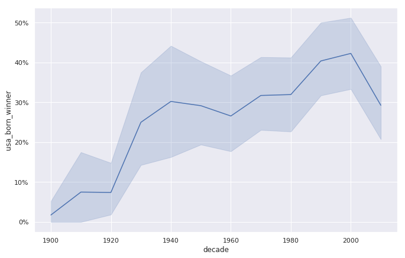
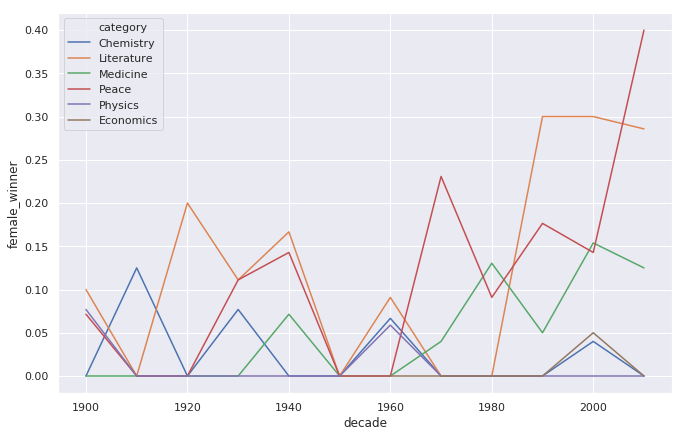
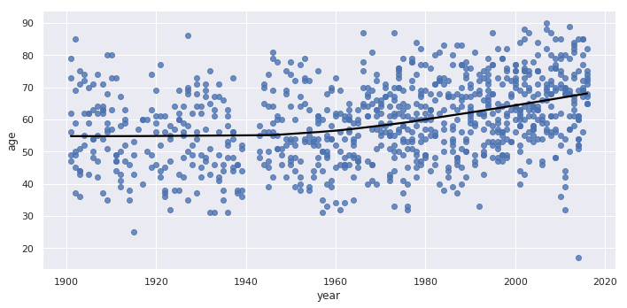
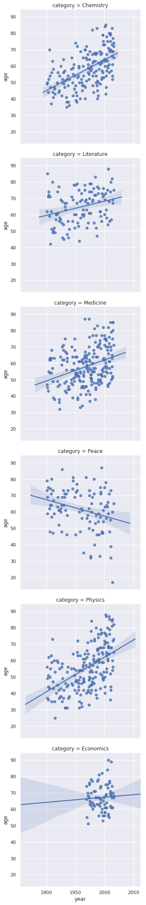

# 🎥 Noble Prizes
The first Nobel Prize was handed out in 1901, and at that time the Prize was very Eurocentric and male-focused, but nowadays it's not biased in any way whatsoever. Surely. Right?

Well, we're going to find out! The Nobel Foundation has made a dataset available of all prize winners from the start of the prize, in 1901, to 2016.

## 🤔 How to use this project

To get started just open the notebook.ipynb using jupyter notebook or any other equivalent

NOTE: You need to also download the datasets folder in order for project to work 

## 💁 What You're Getting
```bash
├── notebook.ipynb
├── datasets folder
```

## 📸 Visualizations from the Project

<h4>USA born winners</h4>


<br/>

<h4>USA born winners with % winners</h4>


<br/>

<h4>age of Nobel Prize winners</h4>


<br/>

<h4>separate plots for each type of Nobel Prize</h4>


<br/>